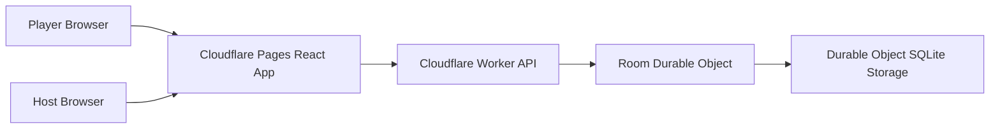

# Architecture

## Goals

- Keep the MVP free or very low cost.
- Keep game state authoritative on the server.
- Make private role data impossible to leak through public snapshots.
- Share game rules across client and server.
- Support a future path to higher traffic without a rewrite.

## System Overview

## Packages

### `packages/domain`

The domain package is the source of truth for:

- Room config limits and defaults.
- Word categories.
- Player creation validation.
- Ready checks.
- Round start selection.
- Suspicion and accusation validation.
- Timer-expiry resolution.
- Scoring.
- Public and private snapshots.

No UI or Worker code should reimplement scoring.

### `apps/worker`

The Worker exposes:

- `POST /api/rooms`
- `POST /api/rooms/:code/join`
- `GET /api/rooms/:code/socket`

Each active room is owned by one Durable Object instance named by room code. The Durable Object is the only writer for room state.

Create and join responses set a room-scoped HttpOnly session cookie. Browser WebSocket upgrades authenticate with that cookie; room tokens are not returned in the JSON response or sent in WebSocket query strings.

### `apps/web`

The web app is a mobile-first React SPA. It renders:

- Host setup.
- Join setup.
- Lobby readiness.
- Private reveal.
- Round timer.
- Suspicion and accusation actions.
- Results.
- Leaderboard.

## Realtime Protocol

Client commands:

- `player.ready.set`
- `host.game.start`
- `host.game.reset`
- `host.room.config.update`
- `player.suspect.create`
- `player.accuse.create`
- `host.player.kick`
- `host.room.cancel`
- `client.heartbeat`

Server events:

- `room.snapshot`
- `private.snapshot`
- `phase.changed`
- `player.joined`
- `player.left`
- `round.resolved`
- `game.finished`
- `command.rejected`

## Privacy Boundary

The public snapshot never contains another player's role or private word. The private snapshot is sent per socket and only contains the current player's role and visible word.

## Persistence

Room state is stored as JSON in Durable Object SQLite storage. The current design keeps persistence intentionally short-lived:

- Active game recovery during room lifetime.
- 24-hour idle cleanup.
- No long-term player history.

## Scaling Path

The MVP scales by room because each room maps to one Durable Object. If the game grows, the next scaling steps are:

- Add analytics with a privacy-preserving free tier or self-hosted option.
- Move curated word management into versioned content files or a CMS only when non-developer editing is needed.
- Add account identity only when repeat-player features justify the cost and privacy tradeoff.
- Add regional routing and observability once traffic requires it.
